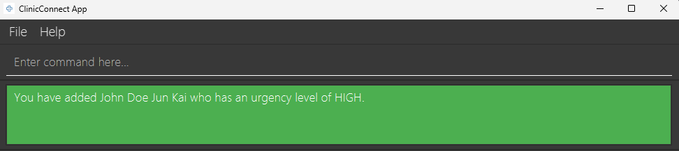

# ClinicConnect User Guide

ClinicConnect is a **desktop app for triage coordinators to manage patient records, optimized for use via a Command Line Interface** (CLI) while still having the benefits of a Graphical User Interface (GUI). If you can type fast, ClinicConnect can get your triage tasks done faster than traditional GUI apps.

<page-nav-print />

--------------------------------------------------------------------------------------------------------------------

## Quick Start

1. Ensure you have Java `17` or above installed in your Computer.
2. Download the latest `clinicconnect.jar` file from our [releases](https://github.com/AY2526S2-CS2103-F11-4/tp/releases/) page.
3. Copy the file to the folder you want to use as the home folder for your clinic's database.
4. Open a command terminal, `cd` into the folder you put the jar file in, and use the `java -jar clinicconnect.jar` command to run the application. 
   A GUI should appear in a few seconds. Note how the app contains some sample triage data. 
   

5. Type the command in the command box and press Enter to execute it. e.g. typing **`help`** and pressing Enter will open the help window. 
   Some example commands you can try:

    * `list` : Lists all patients.
    * `add pn/John Doe p/98765432 e/johnd@example.com a/311, Clementi Ave 2, #02-25 ic/F1234567A u/high nk/John nkp/91234567 nkr/Brother d/Dr Sally s/fever s/cough n/Does not like to eat veggies` : Adds a patient named `John Doe` to ClinicConnect.
    * `update 1 u/high s/Severe chest pain` : Updates the urgency and symptoms of the 1st patient shown in the current list.
    * `find pn/John` : Searches for patients with the name "John".
    * `delete 1` : Deletes the 1st patient shown in the current list.
    * `undo` : Undoes the last command if it changed the data.
    * `exit` : Exits the app safely and saves your data.

6. Refer to the [Features](#features) below for details of each command.

--------------------------------------------------------------------------------------------------------------------

## Features

<box type="info" seamless>

**Notes about the command format:** 

* Words in `UPPER_CASE` and enclosed in angle brackets `<>` describe parameters to be supplied by the user. 
  e.g. in `add pn/<PATIENT_NAME>`, `<PATIENT_NAME>` is a parameter which can be used as `add pn/John Doe`.
* Items in square brackets are optional. 
  e.g. `[n/<NOTES>]` can be used as `n/Patient has history of asthma` or simply left out.
* Arguments can be provided in any order. 
  e.g. if the command specifies `pn/<PATIENT_NAME> p/<PATIENT_PHONE>`, `p/<PATIENT_PHONE> pn/<PATIENT_NAME>` is also acceptable.
* All commands and prefixes are case-insensitive.
* Leading and trailing spaces are ignored/trimmed automatically.
* Internal spaces within a command (e.g. `d ele te 1`) or prefix (e.g. `p  n/`) are not allowed and will be rejected.
* Spaces are not allowed before or after the delimiters (i.e. `,` and `-`) in index-based commands (e.g. `update 1 , 2` will be rejected).

</box>
    
### Viewing help : `help`

Shows a message explaining how to access the help page.

**Format:** `help`

### Adding a patient: `add`

Records comprehensive patient information, add it to the address book and saves it to the hard disk.

**Format:** `add pn/<PATIENT_NAME> p/<PATIENT_PHONE> e/<EMAIL> a/<ADDRESS> ic/<IC> u/<LEVEL> nk/<NEXT_OF_KIN_NAME> nkp/<NEXT_OF_KIN_PHONE> nkr/<NEXT_OF_KIN_RELATIONSHIP> d/<DOCTOR> [s/<SYMPTOM>] [n/<NOTES>]`
* The prefixes `pn/`, `ic/`, `p/`, `a/`, `e/`, `u/`, `d/`, `nk/`, `nkp/`, and `nkr/` are **compulsory** and **must not be blank**.
* The prefixes `s/` and `n/` are **optional**.
* The same prefix **cannot** be provided more than once **except** for `s/` (symptoms).
* All parameters have their leading and trailing spaces ignored/trimmed automatically.

**Patient Name (`pn/`):**
* The patient's name.
* Can contain letters (`A-Z, a-z`), spaces, commas (`,`), hyphens (`-`), apostrophes (`'`), and periods (`.`).
* It is enforced that the first character must be a letter (`A-Z, a-z`) to prevent blank names that only contain spaces.

**IC Number (`ic/`):**
* The patient's IC number.
* Must follow the format: `[S/T/F/G/M]` + 7 digits + 1 letter (total 9 characters). For example, `S1234567A` is a valid IC number.
* Duplicates are **not allowed** (i.e., two patients **cannot** have the same IC number).
* Case-insensitivity (e.g., `s1234567a` is treated the same as `S1234567A`).

**Patient Phone Number (`p/`):**
* The patient's phone number.
* Can contain digits, spaces, and hyphens (`-`), with **an optional** leading plus (`+`).
* Must start with a digit. If `+` is used, it must appear only once at the start and be immediately followed by a digit.
* Must contain between 3 and 15 digits (excluding spaces and hyphens).

**Address (`a/`):**
* The patient's address.
* Can contain any value. However, the first character **cannot** be a whitespace.

**Email Address (`e/`):**
* The patient's email address.
* Must follow the format: `<local-part>@<domain>`, where `<local-part>` and `<domain>` can contain letters, digits, and certain special characters.

**Urgency Level (`u/`):**
* The urgency level of the patient's condition.
* Must be exactly one of: `low`, `moderate`, `high`, `extreme` (case-insensitive).
* The urgency level is used to prioritize patients in the list, with `extreme` being the highest priority and `low` being the lowest.

**Doctor Name (`d/`):**
* The name of the doctor assigned to the patient.
* Can contain letters (`A-Z, a-z`), spaces, commas (`,`), hyphens (`-`), apostrophes (`'`), and periods (`.`).
* It is enforced that the first character must be a letter (`A-Z, a-z`) to prevent blank doctor names that only contain spaces.

**Next-of-Kin Name (`nk/`):**
* The name of the patient's next of kin.
* Can contain letters (`A-Z, a-z`), spaces, commas (`,`), hyphens (`-`), apostrophes (`'`), and periods (`.`).
* It is enforced that the first character must be a letter (`A-Z, a-z`) to prevent blank next-of-kin names that only contain spaces.

**Next-of-Kin Phone Number (`nkp/`):**
* The phone number of the patient's next of kin.
* Can contain digits, spaces, and hyphens (`-`), with **an optional** leading (`+`).
* Must start with a digit. If `+` is used, it must appear only once at the start and be immediately followed by a digit.
* Must contain between 3 and 15 digits (excluding spaces and hyphens).

**Next-of-Kin Relationship (`nkr/`):**
* The relationship of the next of kin to the patient (e.g., "Mother", "Brother", "Friend").
* Can contain letters (`A-Z, a-z`), spaces, commas (`,`), hyphens (`-`), apostrophes (`'`), and periods (`.`).
* It is enforced that the first character must be a letter (`A-Z, a-z`) to prevent blank relationships that only contain spaces.

**Symptoms (`s/`):**
* The symptoms that the patient is experiencing.
* Can contain alphanumeric characters and spaces only (i.e., no special characters).
* A patient can have any number of symptoms (including 0). To specify multiple symptoms, use multiple `s/` prefixes (e.g., `s/fever s/cough`).
* If the prefix is declared then there must be a non-blank symptom after it (e.g., `s/` without any symptoms will be rejected).
* If the prefix is not declared at all, it will be treated as if the patient has no symptoms.
* Symptoms are compared case-insensitively to prevent duplicated entries. However, differences in internal spacing (e.g., "runny nose" vs "runnynose") are treated as distinct symptoms.
* Duplicate symptoms are treated as a single symptom (e.g., `s/fever s/FEVER` will be treated as one symptom "fever").

>**Tip:** A patient can have any number of symptoms (including 0).

**Notes (`n/`):**
* Additional notes about the patient.
* Can contain any characters (including spaces).
* Maximum length of 500 characters.
* If the prefix is declared with a blank note (e.g., `n/` without any notes), it will be treated as an empty note (i.e., the patient will have no notes).
* If the prefix is not declared at all, it will be treated as if the patient has no notes as well.

**Example:**
* `add pn/John Doe Jun Kai ic/M0123456B p/12345678 a/21 Serangan Road e/john@doe.com u/high d/Dr Tan Ah Beng nk/Mary Doe nkp/87654321 nkr/Mother s/Diabetic n/Admitted at 12pm`
  * Expected output: `You have added John Doe Jun Kai who has an urgency level of HIGH.`
  * 

 

<strong>Why is '/' not allowed in names and certain fields?</strong>
 

 

The `/` character is reserved for prefix parsing (e.g., `pn/`, `ic/`, `d/`).
Allowing `/` in structured fields such as patient name (`pn/`), next-of-kin name (`nk/`), doctor name (`d/`), and next-of-kin relationship (`nkr/`) may cause parts of the input to be misinterpreted as command prefixes.

This happens when a substring resembling a valid prefix (e.g., `s/`, `d/`, `u/`) appears after whitespace.

### Examples

| Input Example        | What Happens | Result                                                             |
|----------------------|-------------|--------------------------------------------------------------------|
| `pn/Raj s/o Kumar`   | `s/` is interpreted as the symptom prefix | `o Kumar` treated as a symptom                                     |
| `pn/Ali d/o Hassan`  | `d/` is interpreted as the doctor prefix | May result in a duplicate prefix error or unintended doctor value  |

To ensure reliable parsing and avoid ambiguity, `/` is disallowed in those fields.

**Suggested workaround:**  
Use alternatives such as:
- `Raj s o Kumar`
- `Raj son of Kumar`
- `Raj s-o Kumar`

 

<strong>Why is '/' still allowed address or notes?</strong>
 

 

The `/` character is allowed in free-text fields such as address (`a/`) and notes (`n/`) because it appears in realistic inputs (e.g., `Blk 123/125`, `120/80`).

However, if `/` appears as part of a substring that resembles a valid prefix (e.g., `s/`, `d/`, `u/`) and is preceded by whitespace, the parser may interpret it as a new field.

### Examples

| Input Example                       | What Happens | Result                                                             |
|-------------------------------------|-------------|--------------------------------------------------------------------|
| `n/Patient reports pain s/severe`   | `s/` is interpreted as the symptom prefix | `severe` treated as a symptom                                     |
| `a/Blk 123 Bedok Ave d/near clinic` | `d/` is interpreted as the doctor prefix | May result in a duplicate prefix error or unintended doctor value  |

This behavior is due to the prefix-based command format.

In particular, `s/` is more prone to this issue because it is a repeatable prefix and may not trigger duplicate-prefix validation.

>**Tip**:
Avoid including prefix-like patterns such as `s/`, `d/`, or `u/` in free-text fields. Rephrase them where possible.

 

### Updating patient(s) : `update`

Updates existing patient details in ClinicConnect. You can update a single patient or multiple specific patients at once.

**Format:**

**Single update:** `update <INDEX> [pn/<PATIENT_NAME>] [ic/<IC>] [p/<PATIENT_PHONE>] [a/<ADDRESS>] [e/<EMAIL>] [u/<LEVEL>] [d/<DOCTOR>] [nk/<NEXT_OF_KIN_NAME>] [nkp/<NEXT_OF_KIN_PHONE>] [nkr/<NEXT_OF_KIN_RELATIONSHIP>] [s/<SYMPTOM>][n/<NOTES>] [an/<APPEND_NOTES>]...`
* Edits the patient at the specified `<INDEX>`.

**Multiple update:** `update <INDEX>,<INDEX>[,<INDEX>,...] [pn/<PATIENT_NAME>] [p/<PATIENT_PHONE>] [a/<ADDRESS>] [e/<EMAIL>] [u/<LEVEL>] [d/<DOCTOR>] [nk/<NEXT_OF_KIN_NAME>] [nkp/<NEXT_OF_KIN_PHONE>] [nkr/<NEXT_OF_KIN_RELATIONSHIP>] [s/<SYMPTOM>][n/<NOTES>] [an/<APPEND_NOTES>]...`
* Edits the patients at the specified indices.
* Delimiter: Comma (`,`).
* Duplicated indices (e.g., `update 2,2`) will be rejected.

**Shared rules for updates:**
* The indices refer to the index numbers shown in the displayed patient list and **must be positive integers**.
* **At least one** of the optional fields must be provided.
* Existing values will be overwritten by the input values for all targeted patients, **except for appended notes (`an/`)**.
* **Unique Identifier Restriction:** Because the IC number is a unique identifier, you **cannot** update the IC (`ic/`) when performing a multiple update. You must update ICs individually using the single update command.
* **Symptoms Replacement:** When editing symptoms (`s/`), the existing symptoms of the patient(s) will be replaced by the newly provided ones (i.e., it is not cumulative).
* **Note Handling (Overwrite vs Append):** * Using `n/` will overwrite the existing note entirely.
    * Using `an/` will append the text to the bottom of the existing note on a new line, **automatically prefixing it with the current timestamp** (e.g., `[09 Apr 20:00]`).
    * **Mutually Exclusive:** You **cannot** use both `n/` (overwrite) and `an/` (append) in the same command. If both prefixes are provided, the command will be rejected.
    * *Note constraint:* The total combined length of the notes cannot exceed 500 characters.
* **All-or-Nothing Execution:** If any of the provided indices are invalid (e.g., larger than the total number of patients currently shown in the list), the entire command will be rejected and **no** patients will be updated.
* **Duplicate Conflict:** If updating a patient causes them to have the exact same IC as an already existing patient in the database, the command will be rejected.

>**Tip**: You can remove all symptoms for the selected patient(s) by typing `s/` without specifying any symptoms after it. Similarly, you can completely clear existing notes by typing `n/` without any text.

**Examples:**
* `update 1 p/91234567` Updates the phone number of the 1st patient to be `91234567`.
* `update 1,3 u/extreme` Updates the urgency level of the 1st and 3rd patients to `extreme`.
* `update 2,4,5 d/Dr Sally s/Fever` Updates the doctor to `Dr Sally` and replaces all existing symptoms with `Fever` for the 2nd, 4th, and 5th patients.
* `update 1 an/Patient requested a callback` Appends the text to the 1st patient's existing notes, automatically formatted on a new line as `[09 Apr 20:00] Patient requested a callback`.
* `update 5 n/` Removes the notes from the 5th patient.

### Listing all patients : `list`

Displays all patients in the application in a structured list format. You can also filter the list by urgency level and/or symptoms.

**Format:** `list [u/<LEVEL>]... [s/<SYMPTOM>]...`

* You may provide `u/` (urgency level) to match urgency levels.
* You may provide `s/` (symptoms) to match symptoms.
* If both `u/` and `s/` are provided, patients matching **either** criterion are shown (logical **OR**). Multiple values with the same prefix are also combined with **OR** (e.g. `list u/high u/low` lists high- or low-urgency patients).
* If filters are provided but no patient matches, the command still succeeds and shows a "no matches" message.

**Examples:**
* `list` (shows everyone)
* `list u/high`
* `list s/fever s/cough`
* `list u/high s/fever`

The `list` command and `find` command are intentionally kept separate because of the difference in use cases they satisfy.
`list` functions more as a filter for users to find patients that match the given keywords.
`find` functions more as a search for a specific user.

### Searching for a patient : `find`

Allows triage coordinators to locate specific patient records using various identifiers, reducing the manual effort of scrolling.

**Format:** `find [pn/<PATIENT_NAME>] [ic/<IC>] [p/<PATIENT_PHONE>] [e/<EMAIL>] [d/<DOCTOR>]`

* Finds patients whose identifiers match the given keywords.
* At least one identifier must be provided, each using a prefix: `pn/`, `ic/`, `p/`, `e/`, or `d/`. Unprefixed text and other prefixes (e.g. `n/` for notes) are not accepted.
* The search is case-insensitive.
* Leading and trailing spaces are ignored/trimmed.
* Duplicate prefixes are not allowed in a single `find` command (e.g. `find p/91234567 p/98765432`).
* Only full words will be matched for names (e.g. `Han` will not match `Hans`).
* Patients matching at least one keyword will be returned (i.e. `OR` search).
* Phone search (`p/`) must be exactly 8 digits, matching the format for patient phone numbers.

**Examples:**
* `find pn/Alice` returns patients with the name Alice.
* `find ic/S1234567A` returns the patient with that specific IC.
* `find p/91234567` returns the patient(s) with that phone number.
* `find e/johndoe@example.com` returns the patient(s) with that email.
* `find d/Dr Sally` returns the patient(s) with that doctor name.

### Deleting patient(s) : `delete`

Permanently removes patient records from ClinicConnect.

**Format:**

**Single deletion:** `delete <INDEX>`
* Deletes the patient at the specified `<INDEX>`. The index refers to the index number shown in the displayed patient list. The index **must be a positive integer**.

**Multiple deletion:** `delete <INDEX>,<INDEX>[,<INDEX>,...]`
* Deletes the patients at the specified indices. The indices refer to the index numbers shown in the displayed patient list. The indices **must be positive integers**.
* Delimiter: Comma (`,`)
* Duplicated indices (e.g. `delete 2,2`) will be rejected.

**Range deletion:** `delete <START_INDEX>-<END_INDEX>`
* Deletes the patients in the range of the specified indices. The indices refer to the index numbers shown in the displayed patient list. The indices **must be positive integers**.
* Delimiter: Hyphen (`-`)
* The start index must be less than or equal to the end index.

**Optional fields deletion:** `delete <INDICES> [s/] [n/]`
* Deletes all the symptoms (`s/`) and/or notes (`n/`) of the patients at the specified indices. `<INDICES>` refers to any of the above index formats.
* Prefixes must be provided without any parameters (e.g. `n/notes` will be rejected).
* The patients at the specified indices must have at least 1 value in each of the fields to be deleted.

**Specific values deletion:** `delete <INDICES> [s/<SYMPTOM>]...`
* Deletes the specified symptoms of the patients at the specified indices. `<INDICES>` refers to any of the above index formats.
* All prefixes must be provided with parameters (e.g. `s/fever s/` will be rejected).
* The patients at the specified indices must have all the specified symptoms to be deleted.

>**Tip:** Optional fields deletion for notes and specific values deletion for symptoms can be used together.

**Examples:**
* `delete 2` deletes the 2nd patient in the list.
* `delete 1,3,5` deletes the 1st, 3rd, and 5th patients.
* `delete 1-4` deletes the 1st through 4th patients.
* `delete 1,3 s/ n/` deletes all the symptoms and notes of the 1st and 3rd patients.
* `delete 2 s/fever s/cough` deletes the symptoms "fever" and "cough" of the 2nd patient.
* `delete 2,4 s/fever n/` deletes the symptom "fever" and all notes of the 2nd and 4th patients.

### Undoing the last command : `undo`

Reverts the most recent command if it changed the data. This allows you to quickly reverse accidentally executed commands.

**Format:** `undo`

**Supported Commands:**
* `add` - Restores the deleted patient record
* `delete` - Restores deleted patient records or fields (e.g., symptoms, notes)
* `update` - Single update only (e.g., `update 1 ...`). Bulk update (e.g., `update 1,2 ...`) cannot be undone
* `clear` - Restores all cleared patient records

**Important Notes:**
* Only the **most recent command** can be undone. You cannot undo multiple commands in sequence (e.g., `undo` followed by another `undo` will fail).
* `undo` reverses **only one command execution**. Subsequent commands after an undo cannot be reversed with another undo.
* Read-only commands like `list`, `find`, `help`, and `exit` do not modify data and cannot be undone.
* `undo` commands themselves cannot be undone.

**Error Messages:**
* `Cannot undo: no recent action to undo, or undo was already used.` - This appears when:
  - No data-modifying command has been executed yet, OR
  - You have already used undo on the last command, OR
  - The last command executed was a read-only command (like `list` or `find`)

**Examples:**
* `add pn/John ...` followed by `undo` - removes the patient "John" from the address book
* `delete 1 s/fever` followed by `undo` - restores the "fever" symptom for the 1st patient
* `clear` followed by `undo` - restores all patient records that were cleared
* `update 1 u/extreme` followed by `undo` - reverts the urgency level update for the 1st patient
* `list` followed by `undo` - fails because `list` is read-only and has no effect to undo
* `undo` followed by `undo` - the second undo fails because the previous undo operation cannot be reversed

### Clearing all entries : `clear`

Clears all entries from the clinic records.

**Format:** `clear`

### Exiting safely : `exit`

Exits the application and saves all data to the hard disk.

**Format:** `exit`

* The command does not accept any additional parameters (e.g., `exit now` will be rejected).

--------------------------------------------------------------------------------------------------------------------

### Automatic Triage Sorting

ClinicConnect automatically sorts the patient list to prioritize critical cases:
1.  **Urgency Level:** Patients are ranked `EXTREME` > `HIGH` > `MODERATE` > `LOW`.
2.  **Tie-Breaker:** If two patients have the exact same urgency level, they are sorted alphabetically by their **IC number**. This comparison is case-insensitive (e.g., s1234567a and S1234567A are treated as identical for sorting purposes).

--------------------------------------------------------------------------------------------------------------------

### Command History navigation using the Up/Down arrow keys

ClinicConnect allows you to navigate through your command history using the `Up` and `Down` arrow keys when the command box is focused (_i.e. when there is a blinking vertical line in the command box_). This feature enables you to quickly recall and reuse previous commands without retyping them.

Only the commands that were successfully executed (_i.e. the font color of your input does not turn red after pressing the `enter` key_) are stored in the command history. Those commands will have their trailing and leading whitespaces trimmed before storing in the command history. When you press the `Up` arrow key, you will see the most recent command you entered. Pressing it again will take you further back in your command history. Conversely, pressing the `Down` arrow key will move you forward through the command history.

The command history is session-based, meaning that it is cleared when you exit the application. Therefore, only commands entered during the current session will be available for navigation using the Up and Down arrow keys.

The command history removes duplicated commands, so if you enter the same command multiple times, only the most recent instance will be stored in the history. This helps to keep the command history concise and relevant. Duplicated commands are determined based on their trimmed version and compared in a case-insensitive manner. Commands are considered duplicates only if they are exactly the same after normalization (i.e. trimming leading and trailing whitespaces and ignoring letter casing).

Examples of how duplicated commands are handled in the command history:

| Commands about to enter                                   | Command in command history | Is it considered a duplicate? | Why?                                                                                                                                           |
|-----------------------------------------------------------|----------------------------|-----|------------------------------------------------------------------------------------------------------------------------------------------------|
| `LEADING_WHITESPACES delete 1 s/ n/ TRAILING_WHITESPACES` | `delete 1 s/ n/`           | Yes | After trimming leading and trailing whitespaces, the command is identical to the existing command in the history (case-insensitive comparison). |
| `DELETE 1 S/ N/`                                          | `delete 1 s/ n/`           | Yes | Case-insensitive comparison, the command is identical to the existing command in the history.                                                  |
| `delete 1 n/ s/`                                          | `delete 1 s/ n/`           | No  | Although the both commands are functionally the same, they are not be treated as duplicates as they are not identical                          |

The command history navigation feature enhances your efficiency by allowing you to quickly access and reuse previously entered commands, saving you time and effort in managing patient records with ClinicConnect.

--------------------------------------------------------------------------------------------------------------------

### Data Management

#### Saving the data

ClinicConnect data is saved in the hard disk automatically after any command that changes the data. There is no need to save manually.

#### Editing the data file

ClinicConnect data is saved automatically as a JSON file `[JAR file location]/data/clinicconnect.json`. Advanced users are welcome to update data directly by editing that data file.

<box type="warning" seamless>

**Caution:**
If your changes to the data file make its format invalid, ClinicConnect will discard all data and start with an empty data file at the next run. Hence, it is recommended to take a backup of the file before editing it. 
Furthermore, certain edits can cause ClinicConnect to behave in unexpected ways (e.g., if a value entered is outside the acceptable range). Therefore, edit the data file only if you are confident that you can update it correctly.

</box>

--------------------------------------------------------------------------------------------------------------------

## FAQ

**Q**: How do I transfer my data to another Computer? 
**A**: Install the app in the other computer and overwrite the empty data file it creates with the file that contains the data of your previous ClinicConnect home folder.

--------------------------------------------------------------------------------------------------------------------

## Known issues

1. **When using multiple screens**, if you move the application to a secondary screen, and later switch to using only the primary screen, the GUI will open off-screen. The remedy is to delete the `preferences.json` file created by the application before running the application again.
2. **If you minimize the Help Window** and then run the `help` command (or use the `Help` menu, or the keyboard shortcut `F1`) again, the original Help Window will remain minimized, and no new Help Window will appear. The remedy is to manually restore the minimized Help Window.
3. **For update and delete commands**, when inputting an index more than `2,147,483,647`, the error message will show invalid command format instead of invalid index. However, this does not affect the functionality of the command.

--------------------------------------------------------------------------------------------------------------------

## Command Summary

| Action | Format                                                                                                                                                                                               | Examples                                                                                                                                                                      |
| :--- |:-----------------------------------------------------------------------------------------------------------------------------------------------------------------------------------------------------|:------------------------------------------------------------------------------------------------------------------------------------------------------------------------------|
| **Add** | `add pn/<PATIENT_NAME> ic/<IC> p/<PATIENT_PHONE> a/<ADDRESS> e/<EMAIL> u/<LEVEL> d/<DOCTOR> nk/<NEXT_OF_KIN_NAME> nkp/<NEXT_OF_KIN_PHONE> nkr/<NEXT_OF_KIN_RELATIONSHIP> [s/<SYMPTOMS>] [n/<NOTES>]` | `add pn/John Doe Jun Kai ic/T0123456B p/12345678 a/21 Serangan Road e/john@doe.com u/high d/Dr Tan Ah Beng nk/Mary Doe nkp/87654321 nkr/Mother s/Diabetic n/Admitted at 12pm` |
| **Update** | `update <INDEX>`   `update <INDEX>,<INDEX>`   `... [prefix/<VALUE>]...`                                                                                                                        | `update 1 u/extreme`   `update 1,3 d/Dr Sally`   `update 2,4,5 s/Fever n/`                                                                                              |
| **Search** | `find [pn/<PATIENT_NAME>] [ic/<IC>] [p/<PATIENT_PHONE>] [e/<EMAIL>] [d/<DOCTOR>]`                                                                                                                    | `find e/johndoe@example.com`, `find d/Dr Sally`, `find ic/S1234567A`                                                                                                          |
| **Delete** | `delete <INDEX>`   `delete <INDEX>,<INDEX>`   `delete <START>-<END>`   `delete <INDICES> [s/<SYMPTOM>]... [n/]`                                                                             | `delete 3`   `delete 1,4`   `delete 2-5`   `delete 1 s/fever n/`                                                                                                     |
| **List**   | `list [u/<LEVEL>]... [s/<SYMPTOM>]...`                                                                                                                                                               | `list`   `list u/high`   `list s/fever s/cough`                                                                                                                         |
| **Undo**   | `undo`                                                                                                                                                                                               | `undo`                                                                                                                                                                        |
| **Clear**  | `clear`                                                                                                                                                                                              | `clear`                                                                                                                                                                       |
| **Exit**   | `exit`                                                                                                                                                                                               | `exit`                                                                                                                                                                        |
